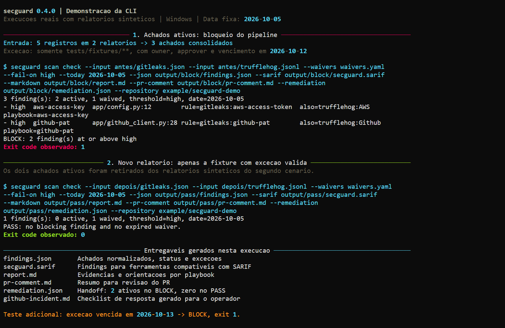

# Reproduce the CLI demonstration

This example uses constructed Gitleaks and TruffleHog reports with placeholder
values. It runs the installed CLI, checks its exit codes and writes its normal
exports. It does not run a scanner, authenticate a credential or change a provider.



The capture records secguard 0.4.0 on Windows, with the date fixed to 2026-10-05.
The example below exercises the same scenarios on Linux and Windows.

## Run it

Clone the repository to obtain the example:

```console
git clone https://github.com/lucashgrifoni/secrets-hygiene-kit.git
cd secrets-hygiene-kit
```

[Install the versioned wheel](https://github.com/lucashgrifoni/secrets-hygiene-kit/blob/main/README.md#install-050) and activate its
virtual environment. Then run:

```console
python examples/demo/run.py
```

The runner creates a new temporary directory and prints its location. It returns
zero only when every expected decision and export check passes. To choose a
destination, provide a new or empty directory:

```console
python examples/demo/run.py --output-dir demo-output
```

Existing files are preserved. You can also pass the path to the installed
executable with `--secguard` instead of activating its environment.

## What to inspect

| Scenario | Observed behavior |
| --- | --- |
| Five observations from two reports | Three canonical findings: two active, one waived; BLOCK, exit 1 |
| New constructed reports contain only the covered fixture | One waived finding; PASS, exit 0 |
| Same fixture after the waiver expires | BLOCK, exit 1 |
| Incident guidance | A GitHub-token response checklist for the operator |

Open `output/block/report.md` and `output/pass/report.md` in the printed directory.
Each scenario also produces JSON, SARIF, a PR comment draft and a remediation
exchange. The exchange contains two active findings for BLOCK and zero for PASS.
The runner verifies that the raw placeholder is absent from exports and CLI output,
and records file hashes and observed exits in `demo-receipt.json`.

The second scenario removes the two active records from the constructed reports.
It demonstrates reconciliation; it does not prove that credentials were revoked
or that an application was remediated. The fixed dates keep the example
reproducible after the sample waiver expires. Use the current date for real CI.

For real report collection and scanner failures, follow the
[quickstart](quickstart.md) and [CI integration guide](https://github.com/lucashgrifoni/secrets-hygiene-kit/blob/main/README.md#ci-integration).
